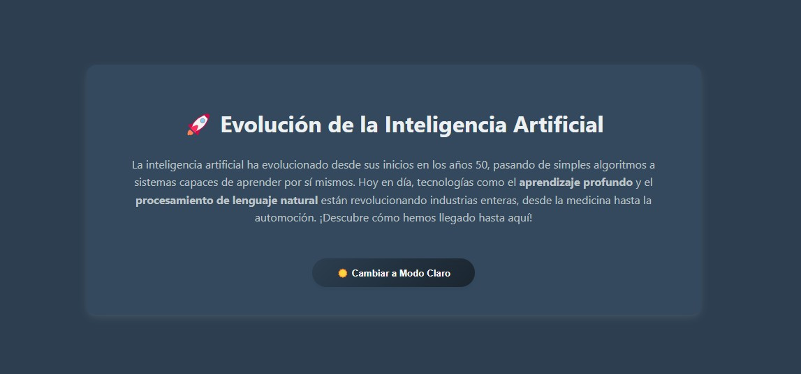

# Proyecto: Evolución de la IA con Modo Oscuro

## Descripción
Aplicación web que muestra información sobre la evolución de la inteligencia artificial, con un diseño moderno y atractivo. Incluye un botón para alternar entre modo claro y oscuro, con transiciones suaves y guardado de preferencias del usuario.

## Características Principales
- **Diseño Centrado y Responsive**: Contenedor con sombras, bordes redondeados y degradados visuales
- **Modo Oscuro Automático**:
  - Guarda la preferencia del usuario en `localStorage`
  - Transiciones suaves entre temas
  - Texto del botón dinámico (🌙/☀️)
- **Animaciones**:
  - Efecto elevación en el botón al pasar el mouse
  - Transiciones de color suaves
- **Contenido Atractivo**:
  - Texto descriptivo con énfasis en conceptos clave
  - Iconos emoji para mejorar la experiencia visual
